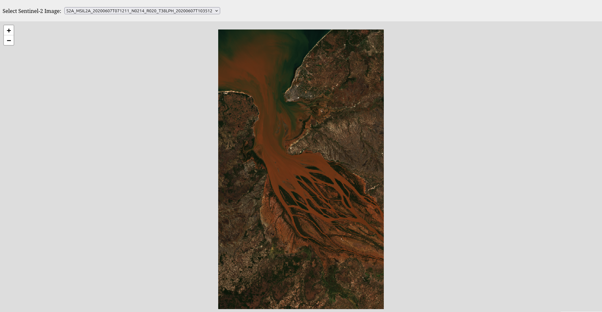
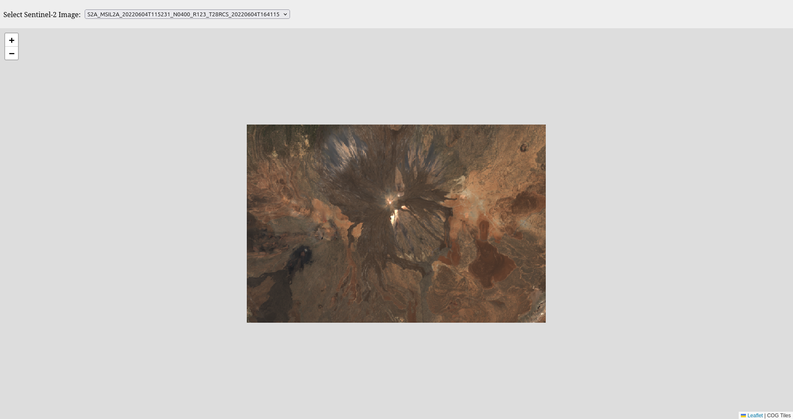

# s2-pipe

## Prerequisites
- Python 3.12.3
- [SentinelHub](https://www.sentinel-hub.com/) account

## Features
- Ingestion of Sentinel-2 images
- Translation into Cloud-Optimized GeoTIFF (COG)
- STAC Item publishing and catalog creation
- Serve via lightweight REST API
- Display in minimal browser-based viewer

## Setting up
Clone the repository
```bash
git clone https://github.com/beltran99/s2-pipe.git
cd s2-pipe/
```

Create virtual environment and install Python dependencies
```bash
python3 -m venv env
source env/bin/activate
python3 -m pip install -r requirements.txt
```

Quick setup to download and process example data from Betsiboka Estuary
```bash
python3 -m setup
```

**__OPTIONAL__**

Download additional Sentinel-2 images via CLI
```bash
python3 -m pipeline.download --bbox <min_lat> <min_lon> <max_lat> <max_lon> --start-date <YYYY-MM-DD> --end-date <YYYY-MM-DD>
```

Open source helper to find bounding boxes from a map: [bboxfinder.com](http://bboxfinder.com/#0.000000,0.000000,0.000000,0.000000).

All downloaded images must be processed for conversion to COG and STAC catalog must be updated
```bash
python3 -m pipeline.process
python3 -m pipeline.stac
```

## Usage
Run FastAPI backend
```bash
uvicorn pipeline.api:app --reload --port 8000
```

Serve the HTML viewer
```bash
# In a new terminal
cd pipeline/viewer
python3 -m http.server 8080
```

Finally, in your browser, open [http://localhost:8080](http://localhost:8080).

## Example screens
Visualization of Betsiboka Estuary


Visualization of Mount Teide
